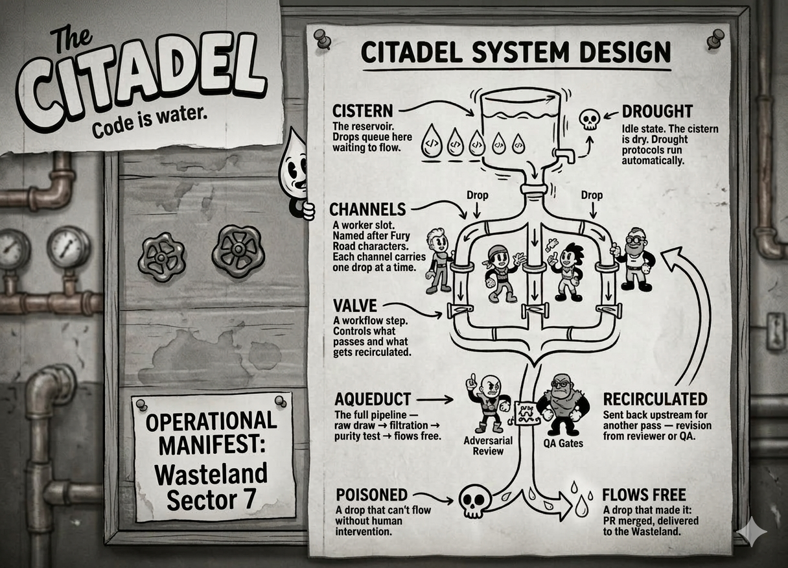

# Citadel

> The Citadel controls the water. Water is life. Code is water.

Citadel is a Mad Max-themed agentic workflow orchestrator. Raw code enters the cistern, flows through channels tended by named workers, is purified by adversarial reviewers and quality gatekeepers, and what flows free at the other end is clean enough to ship.

## The Vocabulary

| Term | Meaning |
|---|---|
| **Drop** | A unit of work — one issue, one feature, one fix. The atomic thing that flows. |
| **Cistern** | The reservoir. Drops queue here waiting to flow. |
| **Channel** | A worker slot. Named after Fury Road characters. Each channel carries one drop at a time. |
| **Valve** | A workflow step. Controls what passes and what gets recirculated. |
| **Aqueduct** | The full pipeline — raw draw → filtration → purity test → flows free. |
| **Drought** | Idle state. The cistern is dry. Drought protocols run automatically. |
| **Flows free** | A drop that made it: PR merged, delivered to the Wasteland. |
| **Recirculated** | Sent back upstream for another pass — revision from reviewer or QA. |
| **Poisoned** | A drop that can't flow without human intervention. |
||



## Quick Start

```bash
# Install
curl -sSL https://raw.githubusercontent.com/MichielDean/citadel/main/install.sh | bash

# Initialize — creates ~/.citadel/citadel.yaml and default workflows
ct init

# Add a drop to the cistern
ct cistern add --title "Add retry logic to fetch" --repo myproject

# Open the aqueducts
ct flow start

# Watch the water flow
ct flow status

# See what's in the cistern
ct cistern list
```

## How It Works

Every drop flows through a sequence of valves:

```
Raw draw → Filtration → Purity test → PR opens → CI gate → Flows free
```

1. **Raw draw** (`implement`) — The Implementer agent reads the drop, writes tests first (TDD/BDD), implements, commits. No outcome until tests pass.

2. **Filtration** (`adversarial-review`) — The Adversarial Reviewer receives *only the diff*. No codebase access, no author context. Finds poison: bugs, security holes, missing tests, logic errors. Context isolation is enforced at the infrastructure level.

3. **Purity test** (`qa`) — The QA Reviewer checks test quality, not just whether tests pass. Finds test gaps, weak assertions, missing error paths, coverage theater. Routes back to raw draw on revision.

4. **Automated valves** — PR opens via `gh pr create`, CI runs and must pass, `gh pr merge` fires. Pure water delivered.

5. **Recirculation** — Revision sends the drop back upstream for another pass. No retry limits. The water flows until it's pure.

## Channel Names

Workers are named from a pool. The default pool is the Fury Road cast:

```
furiosa, nux, immortan, splendid, capable, dag, toast,
angharad, miss-giddy, keeper-of-seeds, organic-mechanic, the-dag
```

Each tmux session is named `<worker>-<drop-id>`. Every `tmux ls` is a scene from the film:

```
furiosa-ct-x7k: 1 windows (filtration)
nux-ct-m3j: 1 windows (raw draw)
```

Change names in `~/.citadel/citadel.yaml` under `names:`.

## Customizing Roles

Roles are defined in your workflow YAML — they're yours to edit. The Citadel adapts.

```bash
ct roles list                  # See all roles and how to edit them
ct roles edit implementer      # Open in $EDITOR, save, CLAUDE.md regenerates
ct roles reset qa              # Restore to built-in default (with confirmation)
ct roles generate              # Regenerate all CLAUDE.md files from YAML
```

Role content lives in `~/.citadel/workflows/feature.yaml` under the `roles:` key. CLAUDE.md files are generated artifacts — the YAML is the source of truth.

## Drought Protocols

When the cistern is dry, the Citadel runs maintenance automatically. Configure in `~/.citadel/citadel.yaml`:

```yaml
# Drought protocols — run when the Citadel is idle
idle_hooks:
  - name: sync-roles
    action: roles_generate     # Regenerate role files when YAML is newer

  - name: prune-worktrees
    action: worktree_prune     # Prune stale aqueduct registrations

  # - name: vacuum-cistern
  #   action: db_vacuum        # Compact the cistern database

  # - name: custom
  #   action: shell
  #   command: "echo $(date): cistern dry >> ~/.citadel/drought.log"
```

Protocols fire once on the `flowing → idle` transition, not on every tick. Safe to add your own.

## Installation

```bash
curl -sSL https://raw.githubusercontent.com/MichielDean/citadel/main/install.sh | bash
```

Requirements:
- Go 1.21+
- `claude` CLI with OAuth login (`claude login`)
- `gh` CLI authenticated (`gh auth login`)
- `git`, `tmux`

## Configuration

```bash
ct init                        # Create ~/.citadel/ with default config and workflows
ct flow config validate        # Check config and all workflow files
ct doctor                      # Full health check
```

Config lives at `~/.citadel/citadel.yaml`. See `citadel.yaml` for all options.

## CLI Reference

```
ct flow start                  Open the aqueducts (start processing)
ct flow status                 Show channels and cistern state
ct flow config validate        Validate config

ct cistern add --title "..." --repo myproject   Add a drop
ct cistern list                                 List drops
ct cistern show <id>                            Show drop details
ct cistern close <id>                           Mark flows free
ct cistern reopen <id>                          Return to cistern
ct cistern purge --older-than 30d               Drain old drops
ct cistern escalate <id> --reason "..."         Poison a drop

ct roles list                  List roles with edit hints
ct roles edit <role>           Edit role in $EDITOR
ct roles generate              Regenerate CLAUDE.md files from YAML
ct roles reset <role>          Restore role to built-in default

ct doctor                      Health check
ct version                     Version info
```

---

*Mediocre code is a parasite. It drinks our resources and starves our projects.*
*The Citadel purifies the water so the Wasteland can drink.*
